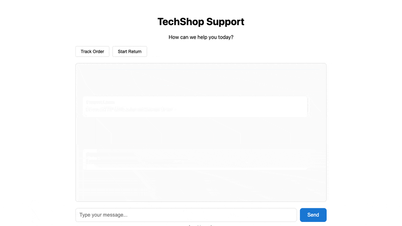

# mimiq

[](https://www.npmjs.com/package/@gojiplus/mimiq)
[](https://www.npmjs.com/package/@gojiplus/mimiq)
[](https://gojiplus.github.io/mimiq/)
[](https://opensource.org/licenses/MIT)

End-to-end testing framework for AI agents with simulated users.



## Features

- **Simulated users with LLM-powered personas** - Generate realistic user behavior from conversation plans
- **Playwright & Cypress adapters** - First-class support for both testing frameworks
- **Multi-provider LLM support** - Google Gemini, OpenAI, Anthropic via Vercel AI SDK
- **Three simulator types** - LLM chat, Stagehand (autonomous browser), browser-use
- **Recording pipeline** - Capture screenshots, transcripts, and action logs
- **Deterministic checks** - Verify tool calls, terminal states, forbidden actions
- **LLM-as-judge evaluation** - Qualitative assessment with majority voting
- **Visual assertions & accessibility audits** - UI validation with confidence thresholds

## Quick Start (Playwright)

### 1. Install

```bash
npm install @gojiplus/mimiq @playwright/test --save-dev
```

### 2. Configure API Key

```bash
# Google (default)
export GOOGLE_GENERATIVE_AI_API_KEY=your-key

# Or OpenAI
export OPENAI_API_KEY=your-key

# Or Anthropic
export ANTHROPIC_API_KEY=your-key
```

### 3. Create Fixtures

**test/fixtures.ts**
```typescript
import { type Page } from "@playwright/test";
import {
  test as mimiqTest,
  createDefaultChatAdapter,
  type MimiqFixtures,
  type MimiqWorkerFixtures,
} from "@gojiplus/mimiq/playwright";
import { createLocalRuntime } from "@gojiplus/mimiq/node";

export const test = mimiqTest.extend<MimiqFixtures, MimiqWorkerFixtures>({
  mimiqRuntimeFactory: [
    async ({}, use) => {
      await use(() =>
        createLocalRuntime({
          scenesDir: "./scenes",
        })
      );
    },
    { scope: "worker" },
  ],

  mimiqAdapterFactory: [
    async ({}, use) => {
      await use((page: Page) =>
        createDefaultChatAdapter(page, {
          transcript: "[data-test=transcript]",
          messageRow: "[data-test=message-row]",
          messageRoleAttr: "data-role",
          messageText: "[data-test=message-text]",
          input: "[data-test=chat-input]",
          send: "[data-test=send-button]",
          idleMarker: "[data-test=agent-idle]",
        })
      );
    },
    { scope: "worker" },
  ],
});

export { expect } from "@playwright/test";
```

### 4. Write a Scene

**scenes/return_backpack.yaml**
```yaml
id: return_backpack
description: Customer returns a backpack

starting_prompt: "I'd like to return an item please."
conversation_plan: |
  Goal: Return the hiking backpack from order ORD-10031.
  - Provide order ID when asked.
  - Cooperate with all steps.

persona: cooperative
max_turns: 15

context:
  customer:
    name: Jordan Lee
    email: jordan@example.com
  orders:
    ORD-10031:
      items:
        - name: Hiking Backpack
          sku: HB-220
          price: 129.99
      status: delivered

expectations:
  required_tools:
    - lookup_order
    - create_return
  forbidden_tools:
    - issue_refund
  allowed_terminal_states:
    - return_created
  judges:
    - name: empathy
      rubric: "The agent maintained a professional and empathetic tone."
      samples: 3
```

### 5. Write the Test

**test/return.spec.ts**
```typescript
import { test, expect } from "./fixtures";

test("processes valid return", async ({ page, mimiq }) => {
  await page.goto("/");
  await mimiq.startRun({ sceneId: "return_backpack" });
  await mimiq.runToCompletion({ maxTurns: 15 });

  const report = await mimiq.evaluate();
  expect(report.passed).toBe(true);
});
```

## Quick Start (Cypress)

### 1. Install

```bash
npm install @gojiplus/mimiq cypress --save-dev
```

### 2. Configure Cypress

**cypress.config.ts**
```typescript
import { defineConfig } from "cypress";
import { setupMimiqTasks, createLocalRuntime } from "@gojiplus/mimiq/node";

export default defineConfig({
  e2e: {
    baseUrl: "http://localhost:5173",
    setupNodeEvents(on, config) {
      const runtime = createLocalRuntime({
        scenesDir: "./scenes",
      });
      setupMimiqTasks(on, { runtime });
      return config;
    },
  },
});
```

**cypress/support/e2e.ts**
```typescript
import { createDefaultChatAdapter, registerMimiqCommands } from "@gojiplus/mimiq";

registerMimiqCommands({
  browserAdapter: createDefaultChatAdapter({
    transcript: '[data-test="transcript"]',
    messageRow: '[data-test="message-row"]',
    messageRoleAttr: "data-role",
    messageText: '[data-test="message-text"]',
    input: '[data-test="chat-input"]',
    send: '[data-test="send-button"]',
    idleMarker: '[data-test="agent-idle"]',
  }),
});
```

### 3. Write the Test

```typescript
describe("return flow", () => {
  afterEach(() => cy.mimiqCleanupRun());

  it("processes valid return", () => {
    cy.visit("/");
    cy.mimiqStartRun({ sceneId: "return_backpack" });
    cy.mimiqRunToCompletion();

    cy.mimiqEvaluate().then((report) => {
      expect(report.passed).to.eq(true);
    });
  });
});
```

## Scene File Format

```yaml
id: string                    # Unique identifier
description: string           # Human-readable description

starting_prompt: string       # First message from simulated user
conversation_plan: string     # Instructions for user behavior
persona: string               # cooperative, frustrated_but_cooperative, adversarial, vague, impatient
max_turns: number             # Maximum turns (default: 15)

simulator:                    # Optional simulator configuration
  type: llm | stagehand | browser-use
  model: "google/gemini-2.0-flash"  # or openai/gpt-4o, anthropic/claude-3-5-sonnet
  options: { ... }

context:                      # World state (optional)
  customer: { ... }
  orders: { ... }

expectations:
  required_tools: [string]           # Must be called
  forbidden_tools: [string]          # Must NOT be called
  allowed_terminal_states: [string]  # Valid end states
  forbidden_terminal_states: [string]
  required_agents: [string]          # For multi-agent systems
  forbidden_agents: [string]
  required_agent_tools:              # Agent-specific tool requirements
    agent_name: [tool1, tool2]
  judges:                            # LLM-as-judge evaluations
    - name: string
      rubric: string
      samples: number              # Number of samples (default: 5)
  visual_assertions:               # UI validation
    - query: string
      min_confidence: number
  accessibility_audit:             # WCAG compliance
    level: A | AA | AAA
    required_pass: boolean
```

## Multiple LLM Providers

Configure your preferred provider via environment variables:

```bash
# Google Gemini (default)
export GOOGLE_GENERATIVE_AI_API_KEY=your-key

# OpenAI
export OPENAI_API_KEY=your-key

# Anthropic
export ANTHROPIC_API_KEY=your-key
```

Specify the model in your scene:

```yaml
simulator:
  model: "google/gemini-2.0-flash"    # Google Gemini
  # model: "openai/gpt-4o"            # OpenAI
  # model: "anthropic/claude-3-5-sonnet"  # Anthropic
```

## Recording Demo Runs

Capture screenshots, transcripts, and action logs for debugging or documentation:

```bash
MIMIQ_RECORDING=1 npx playwright test
```

Configure recording options in your runtime:

```typescript
createLocalRuntime({
  scenesDir: "./scenes",
  recording: {
    enabled: true,
    outputDir: "./recordings",
    screenshots: {
      enabled: true,
      timing: "before",
      format: "png",
    },
    transcript: {
      format: "json",
      includeUiState: true,
    },
    actionLog: {
      enabled: true,
      format: "markdown",
    },
  },
});
```

Output structure:
```
recordings/
└── scene-name/
    └── run-001/
        ├── screenshots/
        │   ├── turn-001.png
        │   └── turn-002.png
        ├── transcript.json
        └── action-log.md
```

## Persona Presets

| Preset | Description |
|--------|-------------|
| `cooperative` | Helpful, provides information directly |
| `frustrated_but_cooperative` | Mildly frustrated but ultimately cooperative |
| `adversarial` | Tries to push boundaries, social-engineer exceptions |
| `vague` | Gives incomplete information, needs follow-up |
| `impatient` | Wants fast resolution, short answers |
| `curious` | Asks questions, explores options |

## LLM-as-Judge

Add qualitative evaluation with LLM judges:

```yaml
expectations:
  judges:
    - name: empathy
      rubric: "The agent maintained an empathetic tone throughout."
      samples: 5
    - name: accuracy
      rubric: "All factual claims were grounded in tool results."
```

Judges use majority voting across multiple samples for reliability.

### Built-in Rubrics

```typescript
import { BUILTIN_RUBRICS } from "@gojiplus/mimiq";

BUILTIN_RUBRICS.TASK_COMPLETION
BUILTIN_RUBRICS.INSTRUCTION_FOLLOWING
BUILTIN_RUBRICS.TONE_EMPATHY
BUILTIN_RUBRICS.POLICY_COMPLIANCE
BUILTIN_RUBRICS.FACTUAL_GROUNDING
BUILTIN_RUBRICS.TOOL_USAGE_CORRECTNESS
BUILTIN_RUBRICS.ADVERSARIAL_ROBUSTNESS
```

## Playwright API

| Method | Description |
|--------|-------------|
| `mimiq.startRun({ sceneId })` | Start a simulation |
| `mimiq.runToCompletion({ maxTurns })` | Run until done or max turns |
| `mimiq.runTurn()` | Execute one turn |
| `mimiq.evaluate()` | Run all checks and judges |
| `mimiq.getTrace()` | Get conversation trace |
| `mimiq.cleanup()` | Clean up resources |
| `mimiq.captureSnapshot()` | Capture current UI state |
| `mimiq.runMultiple({ sceneId, count })` | Run multiple iterations |

## Cypress Commands

| Command | Description |
|---------|-------------|
| `cy.mimiqStartRun({ sceneId })` | Start a simulation |
| `cy.mimiqRunToCompletion()` | Run until done or max turns |
| `cy.mimiqRunTurn()` | Execute one turn |
| `cy.mimiqEvaluate()` | Run all checks and judges |
| `cy.mimiqGetTrace()` | Get conversation trace |
| `cy.mimiqCleanupRun()` | Clean up |

## Environment Variables

| Variable | Description |
|----------|-------------|
| `GOOGLE_GENERATIVE_AI_API_KEY` | Google Gemini API key |
| `OPENAI_API_KEY` | OpenAI API key |
| `ANTHROPIC_API_KEY` | Anthropic API key |
| `MIMIQ_RECORDING` | Enable recording (`1` to enable) |
| `SIMULATOR_MODEL` | Default model for simulation |
| `JUDGE_MODEL` | Default model for judges |

## License

MIT
