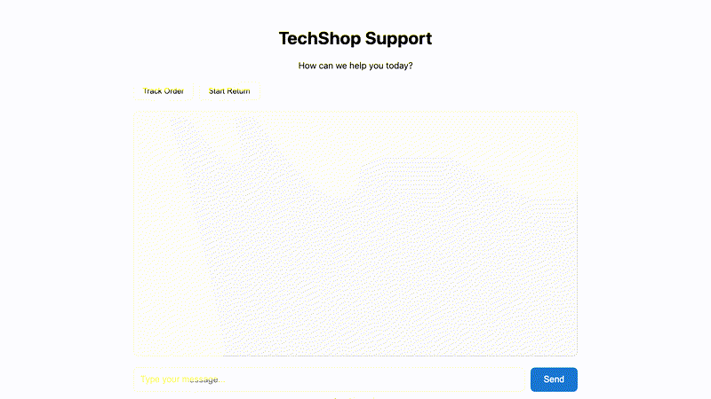

# mimiq

[](https://www.npmjs.com/package/@gojiplus/mimiq)
[](https://www.npmjs.com/package/@gojiplus/mimiq)
[](https://gojiplus.github.io/mimiq/)
[](https://opensource.org/licenses/MIT)

**Test your AI agents like real users would.**



## What is mimiq?

mimiq simulates realistic users to test AI chatbots and agents. Instead of scripted test cases, define user personas and goals—mimiq handles the conversation naturally.

- **Realistic user simulation** — LLM-powered personas that behave like real customers
- **Works with your stack** — Playwright, Cypress, and Stagehand adapters
- **Automated evaluation** — Verify tool calls, terminal states, and qualitative behavior

## 30-Second Setup

```bash
npm install @gojiplus/mimiq @playwright/test --save-dev
export GOOGLE_GENERATIVE_AI_API_KEY=your-key  # or OPENAI_API_KEY
```

Define a scene (`scenes/return_backpack.yaml`):

```yaml
id: return_backpack
starting_prompt: "I'd like to return an item please."
conversation_plan: |
  Goal: Return the hiking backpack from order ORD-10031.
persona: cooperative
max_turns: 15

expectations:
  required_tools: [lookup_order, create_return]
  forbidden_tools: [issue_refund]
```

Run the test:

```typescript
import { test, expect } from "./fixtures";

test("processes valid return", async ({ page, mimiq }) => {
  await page.goto("/");
  await mimiq.startRun({ sceneId: "return_backpack" });
  await mimiq.runToCompletion({ maxTurns: 15 });

  const report = await mimiq.evaluate();
  expect(report.passed).toBe(true);
});
```

## Features

| Feature | Description |
|---------|-------------|
| **LLM-powered personas** | cooperative, frustrated, adversarial, vague, impatient |
| **Multi-provider** | Google Gemini, OpenAI, Anthropic via Vercel AI SDK |
| **Deterministic checks** | required/forbidden tools, terminal states |
| **LLM-as-judge** | Qualitative evaluation with majority voting |
| **Recording pipeline** | Screenshots, transcripts, action logs |
| **Visual assertions** | UI validation with confidence thresholds |

## Persona Presets

| Preset | Behavior |
|--------|----------|
| `cooperative` | Helpful, provides information directly |
| `frustrated_but_cooperative` | Mildly frustrated but ultimately cooperative |
| `adversarial` | Tries to push boundaries, social-engineer exceptions |
| `vague` | Gives incomplete information, needs follow-up |
| `impatient` | Wants fast resolution, short answers |

## Scene File Format

```yaml
id: string                    # Unique identifier
description: string           # Human-readable description
starting_prompt: string       # First message from simulated user
conversation_plan: string     # Instructions for user behavior
persona: string               # cooperative, frustrated_but_cooperative, adversarial, vague, impatient
max_turns: number             # Maximum turns (default: 15)

simulator:
  type: llm | stagehand | browser-use
  model: "google/gemini-2.0-flash"

context:                      # World state
  customer: { ... }
  orders: { ... }

expectations:
  required_tools: [string]
  forbidden_tools: [string]
  allowed_terminal_states: [string]
  judges:
    - name: string
      rubric: string
      samples: number
```

## Playwright Setup

**test/fixtures.ts**
```typescript
import { type Page } from "@playwright/test";
import {
  test as mimiqTest,
  createDefaultChatAdapter,
  type MimiqFixtures,
  type MimiqWorkerFixtures,
} from "@gojiplus/mimiq/playwright";
import { createLocalRuntime } from "@gojiplus/mimiq/node";

export const test = mimiqTest.extend<MimiqFixtures, MimiqWorkerFixtures>({
  mimiqRuntimeFactory: [
    async ({}, use) => {
      await use(() =>
        createLocalRuntime({
          scenesDir: "./scenes",
        })
      );
    },
    { scope: "worker" },
  ],

  mimiqAdapterFactory: [
    async ({}, use) => {
      await use((page: Page) =>
        createDefaultChatAdapter(page, {
          transcript: "[data-test=transcript]",
          messageRow: "[data-test=message-row]",
          messageRoleAttr: "data-role",
          messageText: "[data-test=message-text]",
          input: "[data-test=chat-input]",
          send: "[data-test=send-button]",
          idleMarker: "[data-test=agent-idle]",
        })
      );
    },
    { scope: "worker" },
  ],
});

export { expect } from "@playwright/test";
```

**Playwright API**

| Method | Description |
|--------|-------------|
| `mimiq.startRun({ sceneId })` | Start a simulation |
| `mimiq.runToCompletion({ maxTurns })` | Run until done or max turns |
| `mimiq.runTurn()` | Execute one turn |
| `mimiq.evaluate()` | Run all checks and judges |
| `mimiq.getTrace()` | Get conversation trace |

## Cypress Setup

**cypress.config.ts**
```typescript
import { defineConfig } from "cypress";
import { setupMimiqTasks, createLocalRuntime } from "@gojiplus/mimiq/node";

export default defineConfig({
  e2e: {
    baseUrl: "http://localhost:5173",
    setupNodeEvents(on, config) {
      const runtime = createLocalRuntime({
        scenesDir: "./scenes",
      });
      setupMimiqTasks(on, { runtime });
      return config;
    },
  },
});
```

**cypress/support/e2e.ts**
```typescript
import { createDefaultChatAdapter, registerMimiqCommands } from "@gojiplus/mimiq";

registerMimiqCommands({
  browserAdapter: createDefaultChatAdapter({
    transcript: '[data-test="transcript"]',
    messageRow: '[data-test="message-row"]',
    messageRoleAttr: "data-role",
    messageText: '[data-test="message-text"]',
    input: '[data-test="chat-input"]',
    send: '[data-test="send-button"]',
    idleMarker: '[data-test="agent-idle"]',
  }),
});
```

**Cypress Commands**

| Command | Description |
|---------|-------------|
| `cy.mimiqStartRun({ sceneId })` | Start a simulation |
| `cy.mimiqRunToCompletion()` | Run until done or max turns |
| `cy.mimiqRunTurn()` | Execute one turn |
| `cy.mimiqEvaluate()` | Run all checks and judges |

## LLM-as-Judge

Add qualitative evaluation:

```yaml
expectations:
  judges:
    - name: empathy
      rubric: "The agent maintained an empathetic tone throughout."
      samples: 5
    - name: accuracy
      rubric: "All factual claims were grounded in tool results."
```

**Built-in Rubrics**

```typescript
import { BUILTIN_RUBRICS } from "@gojiplus/mimiq";

BUILTIN_RUBRICS.TASK_COMPLETION
BUILTIN_RUBRICS.INSTRUCTION_FOLLOWING
BUILTIN_RUBRICS.TONE_EMPATHY
BUILTIN_RUBRICS.POLICY_COMPLIANCE
BUILTIN_RUBRICS.FACTUAL_GROUNDING
```

## Recording

Capture screenshots, transcripts, and action logs:

```bash
MIMIQ_RECORDING=1 npx playwright test
```

```typescript
createLocalRuntime({
  scenesDir: "./scenes",
  recording: {
    enabled: true,
    outputDir: "./recordings",
    screenshots: { enabled: true, timing: "before" },
    transcript: { format: "json" },
    actionLog: { enabled: true },
  },
});
```

## Environment Variables

| Variable | Description |
|----------|-------------|
| `GOOGLE_GENERATIVE_AI_API_KEY` | Google Gemini API key |
| `OPENAI_API_KEY` | OpenAI API key |
| `ANTHROPIC_API_KEY` | Anthropic API key |
| `MIMIQ_RECORDING` | Enable recording (`1` to enable) |
| `SIMULATOR_MODEL` | Default model for simulation |
| `JUDGE_MODEL` | Default model for judges |

## License

MIT
