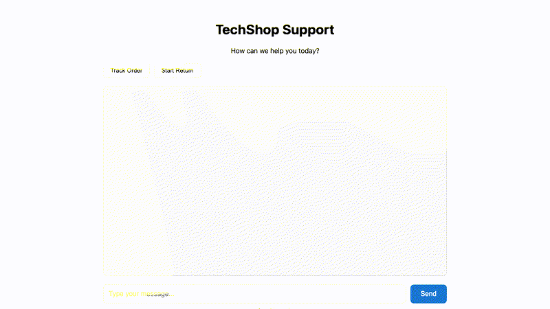

# mimiq

[](https://www.npmjs.com/package/@gojiplus/mimiq)
[](https://www.npmjs.com/package/@gojiplus/mimiq)
[](https://gojiplus.github.io/mimiq/)
[](https://opensource.org/licenses/MIT)

**Simulate goal-directed users in real applications and keep replayable evidence of what happened.**



## What is mimiq?

mimiq is the application-layer simulation harness. Playwright or Cypress runs the browser. mimiq observes the application, chooses the next allowed user action, executes it through the browser adapter, and records the result. The application does not need an agent SDK or framework integration.

- **Goal-directed simulation** — Personas can send messages or choose observed controls, inputs, selects, uploads, and navigation.
- **Browser-owned execution** — Playwright and Cypress remain responsible for clicking, typing, waiting, and screenshots.
- **Evidence bundles** — Each recorded run has a manifest, ordered event log, observations, screenshots, application telemetry, and browser execution outcomes.
- **Replay** — Re-run the successful browser actions in an evidence bundle against a fresh Playwright page.
- **Optional evaluation** — Deterministic checks and judges consume the recorded run; visual analysis can be handled later by LayoutLens.

## 30-Second Setup

```bash
npm install @gojiplus/mimiq @playwright/test --save-dev
ollama run qwen3:8b
export MIMIQ_MODEL=qwen3:8b
export MIMIQ_LLM_BASE_URL=http://127.0.0.1:11434/v1
```

Define a scene (`scenes/return_backpack.yaml`):

```yaml
id: return_backpack
starting_prompt: "I'd like to return an item please."
conversation_plan: |
  Goal: Return the hiking backpack from order ORD-10031.
persona: cooperative
max_turns: 15

expectations:
  required_tools: [lookup_order, create_return]
  forbidden_tools: [issue_refund]
```

Run the test:

```typescript
import { test, expect } from "./fixtures";

test("processes valid return", async ({ page, mimiq }) => {
  await page.goto("/");
  await mimiq.startRun({ sceneId: "return_backpack" });
  await mimiq.runToCompletion({ maxTurns: 15 });

  const report = await mimiq.evaluate();
  expect(report.passed).toBe(true);
});
```

## Features

| Feature | Description |
|---------|-------------|
| **Simulation policies** | conversational personas and browser-use-style observed-action policy |
| **Private model gateway** | Ollama directly, or any model routed through a LiteLLM gateway |
| **Deterministic checks** | required/forbidden tools, terminal states |
| **LLM-as-judge** | Qualitative evaluation with majority voting |
| **Recording pipeline** | Manifest, append-only events, observations, screenshots, transcripts, action outcomes |
| **Visual assertions** | UI validation with confidence thresholds |

## Persona Presets

| Preset | Behavior |
|--------|----------|
| `cooperative` | Helpful, provides information directly |
| `frustrated_but_cooperative` | Mildly frustrated but ultimately cooperative |
| `adversarial` | Tries to push boundaries, social-engineer exceptions |
| `vague` | Gives incomplete information, needs follow-up |
| `impatient` | Wants fast resolution, short answers |

## Scene File Format

```yaml
id: string                    # Unique identifier
description: string           # Human-readable description
starting_prompt: string       # First message from simulated user
conversation_plan: string     # Instructions for user behavior
persona: string               # cooperative, frustrated_but_cooperative, adversarial, vague, impatient
max_turns: number             # Maximum turns (default: 15)

simulator:
  type: llm | browser-use
  model: "qwen3:8b"

context:                      # World state
  customer: { ... }
  orders: { ... }

expectations:
  required_tools: [string]
  forbidden_tools: [string]
  allowed_terminal_states: [string]
  judges:
    - name: string
      rubric: string
      samples: number
```

`browser-use` is mimiq's in-process browser action policy. It is not a dependency on the Python browser-use package or a separate browser service. The policy receives the current observed affordances and may select only those targets; the Playwright or Cypress adapter executes the action.

## Model Gateway

The policy model is a runtime concern, not an application integration. Mimiq uses Ollama directly by default. For hosted models or routing, point the runtime at a LiteLLM gateway. The transport is private to Mimiq; scenes and the browser adapter do not identify model providers or contain provider credentials.

The local Qwen default uses the gateway's `reasoning_effort: "none"` control so browser turns do not spend their turn budget on a hidden reasoning trace. Set `MIMIQ_LLM_REASONING_EFFORT` for a gateway-specific supported level, or pass `reasoningEffort: null` in a programmatic model configuration to omit the control.

```bash
export MIMIQ_MODEL=mimiq-policy
export MIMIQ_LLM_BASE_URL=http://127.0.0.1:4000
export MIMIQ_LLM_API_KEY=your-litellm-key
```

`mimiq-policy` is a LiteLLM model alias. Define its provider, deployment, and credentials in LiteLLM's configuration.

## Playwright Setup

**test/fixtures.ts**
```typescript
import { type Page } from "@playwright/test";
import {
  test as mimiqTest,
  createDefaultChatAdapter,
  type MimiqFixtures,
  type MimiqWorkerFixtures,
} from "@gojiplus/mimiq/playwright";
import { createLocalRuntime } from "@gojiplus/mimiq/node";

export const test = mimiqTest.extend<MimiqFixtures, MimiqWorkerFixtures>({
  mimiqRuntimeFactory: [
    async ({}, use) => {
      await use(() =>
        createLocalRuntime({
          scenesDir: "./scenes",
          recording: {
            enabled: true,
            outputDir: "./test/recordings",
          },
        })
      );
    },
    { scope: "worker" },
  ],

  mimiqAdapterFactory: [
    async ({}, use) => {
      await use((page: Page) =>
        createDefaultChatAdapter(page, {
          transcript: "[data-test=transcript]",
          messageRow: "[data-test=message-row]",
          messageRoleAttr: "data-role",
          messageText: "[data-test=message-text]",
          input: "[data-test=chat-input]",
          send: "[data-test=send-button]",
          idleMarker: "[data-test=agent-idle]",
        })
      );
    },
    { scope: "worker" },
  ],
});

export { expect } from "@playwright/test";
```

**Playwright API**

| Method | Description |
|--------|-------------|
| `mimiq.startRun({ sceneId })` | Start a simulation |
| `mimiq.runToCompletion({ maxTurns })` | Run until done or max turns |
| `mimiq.runTurn()` | Execute one turn |
| `mimiq.evaluate()` | Run all checks and judges |
| `mimiq.getTrace()` | Get conversation trace |
| `mimiq.replayEvidenceBundle(runDir)` | Replay successful recorded browser actions against the current page |

## Arbitrary Browser Applications

For a non-chat UI, use the generic browser adapter. It discovers visible buttons, links, inputs, selects, uploads, and editable controls, and only executes targets observed in the current page. No application-side instrumentation is required for browser evidence.

```typescript
import { createBrowserAdapter } from "@gojiplus/mimiq/playwright";

const adapter = createBrowserAdapter(page);
```

The generic adapter treats a scene's initial chat message as intent only: it records that turn but does not send it to the page because no message control is configured. Subsequent policy turns operate the discovered controls. Use `createDefaultChatAdapter` for a chat UI, or provide a dedicated adapter for an application-specific interaction.

## Optional Application Telemetry

Browser evidence records what Mimiq observed and did. When the application can expose a meaningful business event, it may add a named event to the evidence bundle. This is optional and does not require an agent SDK.

```typescript
window.dispatchEvent(new CustomEvent("mimiq:telemetry", {
  detail: {
    name: "refund.previewed",
    data: { orderId: "ORD-10031", amount: 17.5 },
  },
}));
```

Mimiq records the event exactly as supplied. Do not put credentials, authentication headers, or sensitive payloads in telemetry. Generic browser/network capture is not treated as a business-tool call because Mimiq cannot safely infer that meaning.

### Agent Tool Telemetry

When an agent calls tools that are not visible in the UI, emit the normalized event below. The default Playwright chat adapter records it with the next observation so tool-specific checks can use it; no agent SDK integration is required.

```typescript
window.dispatchEvent(new CustomEvent("mimiq:agent-tool-call", {
  detail: {
    id: "lookup-order-attempt-1",
    name: "lookup_order",
    args: { order_id: "ORD-10031" },
    result: { found: true },
  },
}));
```

## Cypress Setup

**cypress.config.ts**
```typescript
import { defineConfig } from "cypress";
import { setupMimiqTasks, createLocalRuntime } from "@gojiplus/mimiq/node";

export default defineConfig({
  e2e: {
    baseUrl: "http://localhost:5173",
    setupNodeEvents(on, config) {
      const runtime = createLocalRuntime({
        scenesDir: "./scenes",
      });
      setupMimiqTasks(on, { runtime });
      return config;
    },
  },
});
```

**cypress/support/e2e.ts**
```typescript
import { createDefaultChatAdapter, registerMimiqCommands } from "@gojiplus/mimiq";

registerMimiqCommands({
  browserAdapter: createDefaultChatAdapter({
    transcript: '[data-test="transcript"]',
    messageRow: '[data-test="message-row"]',
    messageRoleAttr: "data-role",
    messageText: '[data-test="message-text"]',
    input: '[data-test="chat-input"]',
    send: '[data-test="send-button"]',
    idleMarker: '[data-test="agent-idle"]',
  }),
});
```

**Cypress Commands**

| Command | Description |
|---------|-------------|
| `cy.mimiqStartRun({ sceneId })` | Start a simulation |
| `cy.mimiqRunToCompletion()` | Run until done or max turns |
| `cy.mimiqRunTurn()` | Execute one turn |
| `cy.mimiqEvaluate()` | Run all checks and judges |

## LLM-as-Judge

Add qualitative evaluation:

```yaml
expectations:
  judges:
    - name: empathy
      rubric: "The agent maintained an empathetic tone throughout."
      samples: 5
    - name: accuracy
      rubric: "All factual claims were grounded in tool results."
```

**Built-in Rubrics**

```typescript
import { BUILTIN_RUBRICS } from "@gojiplus/mimiq";

BUILTIN_RUBRICS.TASK_COMPLETION
BUILTIN_RUBRICS.INSTRUCTION_FOLLOWING
BUILTIN_RUBRICS.TONE_EMPATHY
BUILTIN_RUBRICS.POLICY_COMPLIANCE
BUILTIN_RUBRICS.FACTUAL_GROUNDING
```

## Recording

Capture screenshots, transcripts, and action logs:

```bash
MIMIQ_RECORDING=1 npx playwright test
```

```typescript
createLocalRuntime({
  scenesDir: "./scenes",
  recording: {
    enabled: true,
    outputDir: "./recordings",
    screenshots: { enabled: true, timing: "before" },
    transcript: { format: "json" },
    actionLog: { enabled: true },
  },
});
```

## Environment Variables

| Variable | Description |
|----------|-------------|
| `MIMIQ_MODEL` | Model or gateway alias; defaults to `qwen3:8b` |
| `MIMIQ_LLM_BASE_URL` | Private model-gateway URL; defaults to Ollama at `http://127.0.0.1:11434/v1` |
| `MIMIQ_LLM_API_KEY` | Private model-gateway key; defaults to `ollama`, which Ollama ignores |
| `MIMIQ_LLM_REASONING_EFFORT` | Model-gateway reasoning level; defaults to `none` for responsive Qwen browser turns |
| `MIMIQ_RECORDING` | Enable recording (`1` to enable) |
| `MIMIQ_SIMULATOR_MODEL` | Overrides `MIMIQ_MODEL` for simulation |
| `MIMIQ_JUDGE_MODEL` | Overrides `MIMIQ_MODEL` for judges |

## License

MIT
